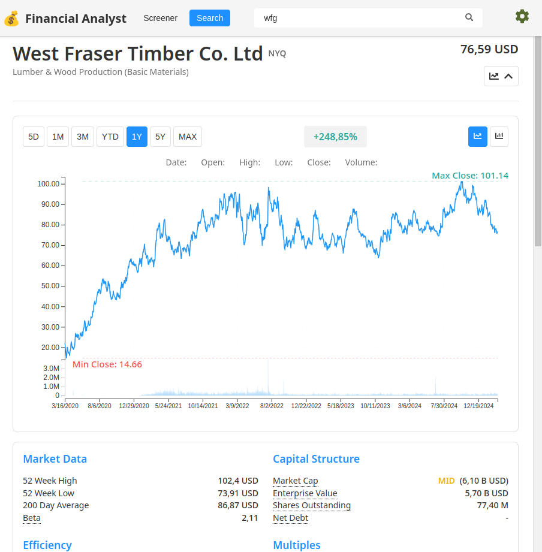
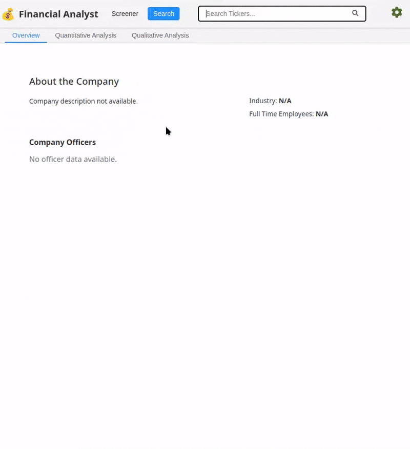

# Financial Analyst

## Overview
Financial Analyst is an application designed to help value investors to analyze stock financial data and make informed financial decisions. This tool combines data visualization and some evaluation method like DCF and DDM.  

This is the frontend part of the application, created 
to consume the [filingsAnalyzer API](https://github.com/Bigghis/filingsAnalyzer) and display the results in a user-friendly way.

## Features
- **Authentication**: handle authentication and authorization to the API
- **Quantitative Analysis**: Show all stock financial data (Income Statement, Balance Sheet, Cash Flow Statement, multiples, DCF, DDM, etc.)
- **Qualitative Analysis**: To be implemented... 
- **SWOT Analysis**: To be implemented... (AI generated)
- **Risk Analysis**: To be implemented... (AI generated)
- **Comparative Analysis**: To be implemented... (AI generated)

### Tech Stack
- React (pure! UI components developed by myself)
- Vite.js for build tools
- Tanstack Router
- Tanstack Table
- JWT for authentication
- d3.js for charts

## Installation

### Prerequisites 
You must have [filingsAnalyzer API](https://github.com/Bigghis/filingsAnalyzer) up and running!

### Install and run the frontend application
1. clone the repository
2. run `npm install` to install the dependencies
3. run `npm run dev` to start the development server
4. going to http://localhost:5173/

## Examples 

#### Main screen with prices graph

#### Income Statement Qualitative Analysis:

#### Balance Sheet Qualitative Analysis:

 

#### Cash Flow Analysis:

